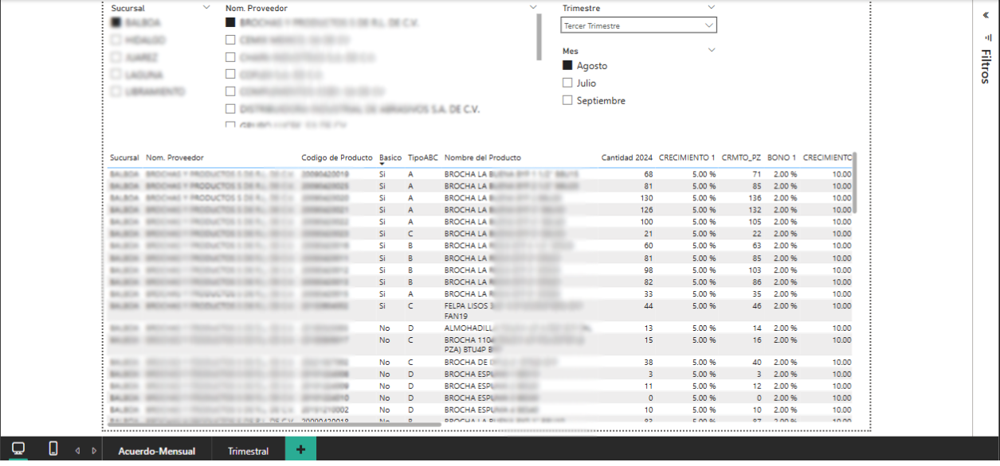
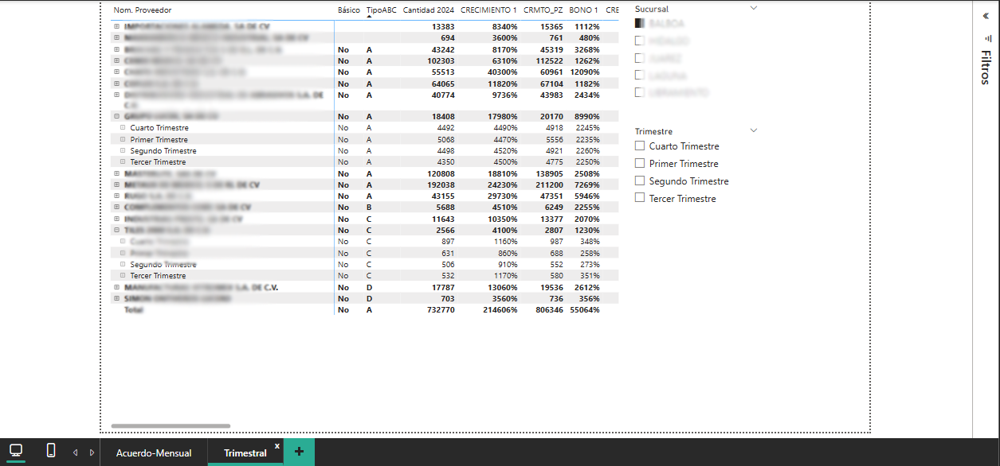

# Crecimiento_Comercial
Objetivos_Sucursales es un reporte desarrollado en Power BI enfocado en la consolidación de información proveniente de distintas fuentes, con el objetivo de proporcionar a los gerentes de tienda una herramienta clara y funcional para el seguimiento de sus metas comerciales.

# Crecimiento_Comercial – Power BI Report

**Crecimiento_Comercial** es un borrador de reporte desarrollado en Power BI, diseñado para consolidar y cruzar múltiples fuentes de información relevantes para los acuerdos comerciales establecidos entre el área de compras y los proveedores. Este reporte sienta las bases para un sistema integral que, una vez implementado permanentemente por el equipo de TI, permitirá a los gerentes de tienda monitorear de manera eficiente el cumplimiento de objetivos y bonificaciones, alineados con las metas de crecimiento pactadas.

---

## 1. acuerdo_mensual

**Propósito:**  
Presenta de manera clara y dinámica el listado mensual de productos incluidos en los acuerdos comerciales con proveedores. Permite visualizar las metas de crecimiento y los distintos bonos alcanzables, filtrando la información por trimestre, proveedor, sucursal y otros parámetros relevantes. Esto habilita a los usuarios a identificar rápidamente las oportunidades y retos de cada periodo.

---

## 2. acuerdo_trimestral

**Propósito:**  
Despliega en formato de matriz el consolidado trimestral por proveedor, incluyendo el listado de artículos y las cantidades objetivo a alcanzar. También permite el filtrado por sucursal y otros criterios clave, facilitando el análisis de desempeño y el seguimiento puntual del cumplimiento de los acuerdos comerciales.

---

## 🧠 Reflexión sobre la consolidación de información y el seguimiento de objetivos

La capacidad de consolidar información proveniente de diversas fuentes en un solo reporte no solo representa un avance tecnológico, sino que transforma la gestión operativa al hacer accesible y comprensible la información clave para la toma de decisiones. Este tipo de soluciones facilita el **trackeo de objetivos** para los gerentes, permitiéndoles enfocar sus esfuerzos en las metas realmente relevantes y visualizar de manera transparente el impacto de sus acciones respecto a los compromisos comerciales.

Al anticipar y centralizar la información necesaria, **Acuerdos-Compras** aporta claridad, eficiencia y un nuevo estándar de profesionalización en la gestión de objetivos. Esta metodología maximiza el aprovechamiento de Power BI, mostrando dominio en la integración y modelado de datos, así como en la creación de herramientas que conectan la estrategia comercial con la operación diaria. En definitiva, este trabajo refleja cómo el análisis de datos bien aplicado puede convertirse en una verdadera palanca de crecimiento para el negocio.

---

> **Nota:**  
> Los datos y nombres presentados en las imágenes han sido editados y anonimizados por motivos de confidencialidad.
> Las visualizaciones mostradas son únicamente demostrativas de la estructura y el alcance del modelo desarrollado.

## 📧 Contacto

reyes061295@gmail.com  
[LinkedIn](https://www.linkedin.com/in/marb951206/) | [GitHub](https://github.com/mreyes-analytics)
